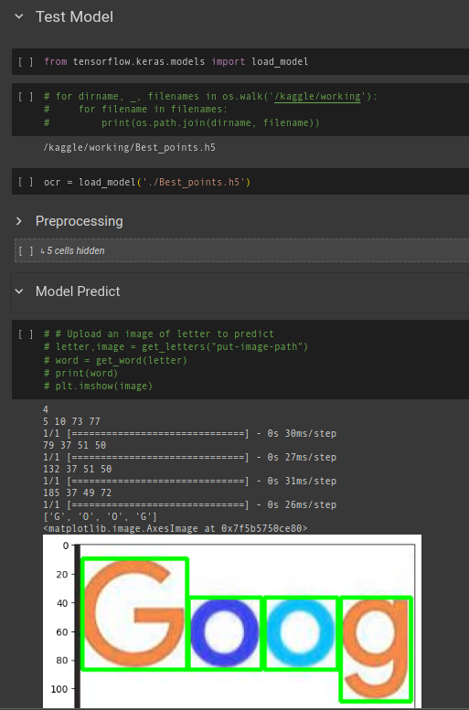
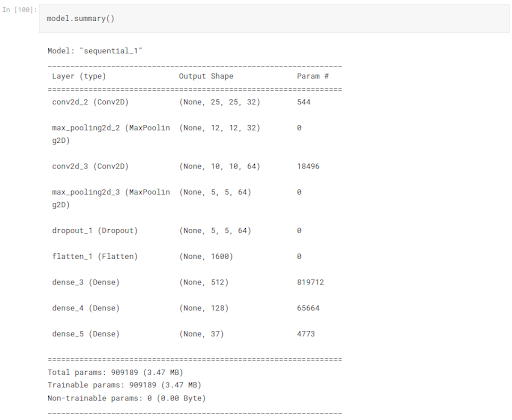
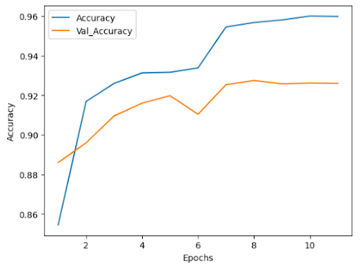

# Letters Recognition Machine Learning Model

## Requirements
- Jupyter Notebook Environment (e.g. Google Colab) 
- Kaggle Account (to download datasets)

Google Colab link : https://colab.research.google.com/drive/1J8in8efb9yENm-e62Cp5tBuWj0rbcN44#scrollTo=WW8FSsFQFuS_

## How to run
1. Create Kaggle Token API from Account Settings
2. Open the 'letters_recognition.ipynb'
3. Simply run all the cells on the notebook
4. Put username and key from 'kaggle.json', that is generated when creating Kaggle Token API, if asked

Access API through http://127.0.0.1:5000

## Usage
To use the model, use all of the code cells on "Test Model" section which includes the preprocessing function and the predict function.

## Model Summary

from the model architecture above, we got 95.67% accuracy and 92.75% validation accuracy.

